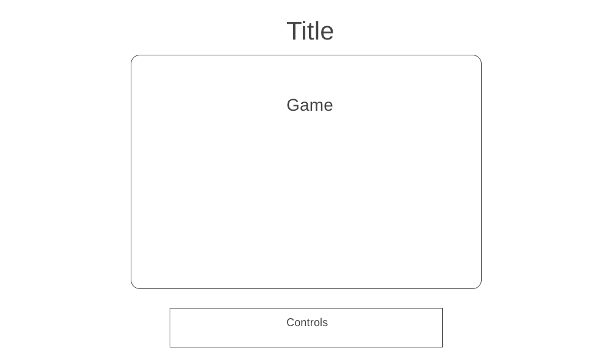

## JS Project Proposal: Joust

### Background

*Joust*, developed by Williams Electronics and released in 1982, is an arcade game
set in a far-flung alternate reality in which knights joust one another mounted on flying
ostriches.

Gameplay is simple. There are three buttons—two to move right and left, and one to flap
your ostrich's wings. If you collide with an enemy, victory is determined by relative
altitude. Levels are completed when all enemies are cleared away.

### Functionality and MVP

With this iteration of *Joust*, users will be able to:

- Start, pause, and reset the game.
- Move and attack enemies.
- Accumulate points and advance between levels of accelerating difficulty.

In addition, this project will include:

- A production README.

Time permitting, we will:

- Incorporate a competitive two-player mode.
- Create more advanced A.I. opponents.

### Wireframes

This game will exist on a single page. It will include the game, controls, and links to my
GitHub and LinkedIn accounts.

### Architecture and Technologies

This project will be implemented using the following technologies:

- `JavaScript` for game logic.
- `p5.js` for effects rendering.
- `Webpack` to bundle JS files.

In addition to the entry file, there will be three scripts included in this project:

`board.js`—for rendering the game board and managing collision, etc.
`ai.js`—for handling CPU player logic.
`ostrich.js`—for handling the movement and behavior of all ostrich sprites.

### Implementation and Timeline

**Day 1**
This day will be spent installing the proper libraries, setting up the basic structure,
and rendering a single object.

**Day 2**
Primarily, we'll be learning p5.js today, as well as a game-focused library for p5, play.js.
By the end of today, we hope to have set up user input, object collision, and a game board.

**Day 3**
Today will be focused on A.I. and combat. By the end of the day today, we'd like to have a
fully-functional level, with enemies that can fight and die.

**Day 4**
Our final day will be housekeeping. We will implement a points system, multiple levels, and
refine the look of the game.
